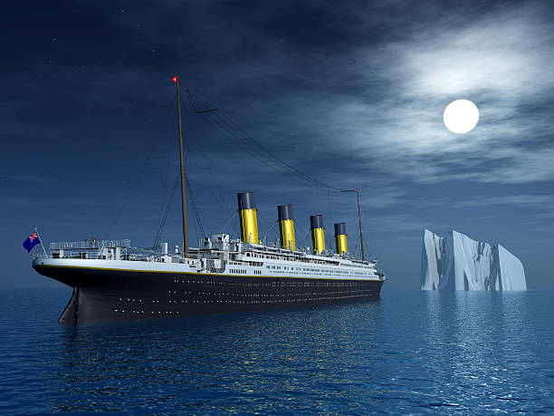

# Titanic---Machine-Learning-from-Disaster

Salut ! 👋 Bienvenue dans mon projet Kaggle sur le Titanic ! 🚢

Il s'agit d'un projet de machine learning où j'ai essayé de prédire quels passagers ont survécu au naufrage du Titanic en 1912, en utilisant des données sur les passagers comme leur nom, leur âge, leur sexe ou leur classe sociale.

## Contexte

Le Titanic est connu pour son tragique naufrage lors de son premier voyage. Malheureusement, beaucoup de vies ont été perdues parce qu'il n'y avait pas assez de canots de sauvetage. Avec ce projet, j'essaie de voir s'il est possible de prédire la survie des passagers en fonction de leurs caractéristiques.

## Objectif du Projet

L'objectif ici est de créer un modèle de machine learning capable de prédire la survie des passagers du Titanic.

## Données Utilisées

J'ai utilisé deux jeux de données fournis par Kaggle :

- train.csv : Contient des informations sur les passagers et si ils ont survécu ou non. J'ai utilisé ce fichier pour entraîner mon modèle.
- test.csv : Contient des informations similaires sans les résultats de survie. J'ai utilisé ce fichier pour tester mon modèle et soumettre mes prédictions sur Kaggle.

## Comment j'ai Travaillé sur ce projet

Téléchargement des données : J'ai commencé par télécharger les données de Kaggle.
Exploration des données : Ensuite, j'ai analysé les données pour comprendre les différentes caractéristiques des passagers.
Construction du modèle : J'ai construit plusieurs modèles de machine learning pour essayer de prédire la survie des passagers.
Soumission des prédictions : Enfin, j'ai soumis mes prédictions sur Kaggle pour voir comment je me compare aux autres.

## Conclusion

Ce projet a été une excellente opportunité pour moi de m'entrainer sur le machine learning et d'expérimenter avec des données historiques.
